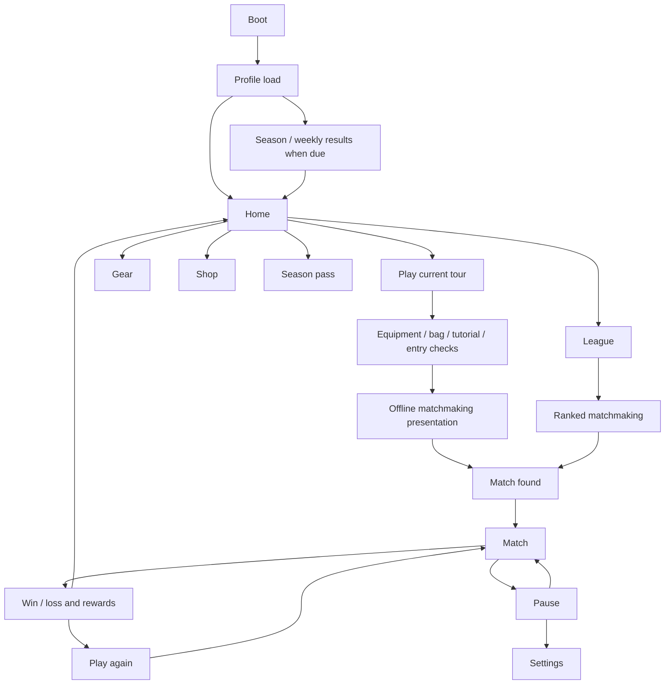

> Implementation update: see [GameFlowImplementation.md](GameFlowImplementation.md) for the completed screens, fixes, checks and remaining service dependencies. The findings below describe the pre-implementation audit.

# Game flow and screen audit

Audited 8 September 2026. Scope: current Unity implementation and navigation, following the supplied UI reference work. Reference documents were treated as design material, not instructions to expand the product.

## Finding

The project has 18 routed screen states, plus gameplay HUD, pause, match results and decision modals. Most core screens exist. The main gaps are disconnected navigation, missing recovery states and unfinished account/reward/store flows.

## Current flow

TourSelect is implemented but has no visible incoming route from the current home/bottom navigation. The Settings-to-Pause return is broken. Play Again needs a separate online path.

## Screens and states to add or complete

| Priority | Screen or state | Required behavior | Existing work to reuse |
|---|---|---|---|
| P1 | Play mode selection | Choose Tour or Ranked; show current tour, entry cost and potential rewards before committing. | Reconnect TourSelect; keep League's ranked shortcut. A sheet is sufficient. |
| P1 | Bag inventory | Show every slot, empty/full states, unlock timers, selected bag opening and gem skip confirmation. | Existing chest reveal, unlock and skip logic. Current Home shows only selected first matching slots. |
| P1 | Connection recovery | Show reconnecting, opponent disconnected, grace countdown, recovered and interrupted-match outcomes. | Network controller already has a 15-second peer grace window but mostly logs these events. |
| P1 | Matchmaking recovery | Present clear error, Retry and Cancel actions; optionally offer offline play. | Existing search screen displays connection error text and Cancel. |
| P1 | Online play-again state | Either return to ranked matchmaking or implement rematch request, waiting, accepted, declined and opponent-left states. | Existing results panel; do not use the local restart path for an online rematch. |
| P1 | Confirm quit/forfeit | Explain the consequence and provide Continue Playing / Forfeit before applying the loss. | Existing decision modal and pause screen. |
| P2 | Account/profile | Guest identity, account linking/sign-in and meaningful sign-out behavior if accounts are in scope. | Advanced settings already contains name/player ID. Current LOG OUT is a placeholder. |
| P2 | Profile-load recovery | Loading failure, Retry and an explicit offline/guest route consistent with save policy. | Boot currently proceeds after its wait; backend load errors can resemble a missing profile. |
| P2 | Season/league settlement | Actual previous-period rank, promotion/demotion, earned rewards and claimed state. | Existing season-complete and startup league-results screens. |
| P2 | Purchase states | Product confirmation, pending, success, cancellation/failure and entitlement restoration as appropriate. | Shop exists; several real-money products are marked unavailable. Premium pass currently routes to generic Shop. |
| P3 | Help/practice entry | Let players replay instructions from Settings; add interactive practice if required. | A first-match tutorial already exists. |

P1 means core flow completion before broader player testing; P2 depends on online/account/monetization release scope. These are not all separate full-screen designs: reuse modals and overlays where possible.

## Flow defects to fix first

1. **Pause → Settings → Back stays on Settings.** Reproduced in Unity Play mode by invoking the actual Settings back button: Settings remained active, Pause was absent and timeScale remained 0. `ShowSettingsFromPause` keeps `inPause=true`; its back callback calls `ShowPause`, which returns early for that flag. Evidence: `Assets/Scripts/UI/ScreenManager.cs:645–686`.
2. **LOG OUT opens a purchase error.** Reproduced in Play mode: the popup says Account sign-out needs an in-app purchase. Evidence: `Assets/Scripts/UI/Screens/SettingsScreen.cs:83`, `ScreenManager.cs:402`.
3. **Device Back has no explicit live-match route.** Source inspection: entering a match clears its screen but leaves the routed screen ID; Back treats MatchIntro as an exit-to-lobby route. Introduce an explicit active-match state so Back opens Pause and follows the forfeit policy. Evidence: `ScreenManager.cs:128–146`, `:520` and online entry path. Device testing still required.
4. **Daily gift CLAIM can open an empty bag screen.** Home shows the gift if either a bag is ready or a daily reward is available, but the button always opens a bag. When only the daily reward is available, this leads to NO BAG READY instead of claiming the daily reward. Evidence: `Assets/Scripts/UI/Screens/LobbyScreen.cs:264–292`, `ChestOpeningScreen.cs:15`.
5. **Ranked Play Again uses local restart.** The results action reaches `RequestRematch`, which calls `RallyManager.RestartMatch` without a new peer agreement/start handshake. Evidence: `ScreenManager.cs:758–774`, `Assets/Scripts/Managers/RallyManager.cs:538`. Source finding; two-client testing is required to measure the resulting desynchronization.
6. **Displayed season rewards do not share the claim reward definition.** The pass displays fixed reward arrays, while claiming computes coins as `200 + tier * 25` and occasional gems. Use a single reward definition for display and grant, plus actual season dates and premium ownership. Evidence: `SeasonPassScreen.cs:26–40`, `:89`, `:189`; `Assets/Scripts/Data/MetaGameState.cs:184`.

## Existing screens to retain

- Boot, Home, matchmaking, match intro and gameplay HUD.
- Pause, Settings and victory/defeat result panel with reward feedback.
- Gear loadout, catalog, detail and upgrade reveal.
- Chest opening/reward reveal, Shop, League and Season Pass.
- TourSelect, Tutorial, season complete and startup standing/league result screens: improve their entry points or data rather than duplicating them.

## Recommended completed play loop

Home → Play mode → Tour selection or Ranked → pre-match checks/tutorial → search → match found → gameplay → results → another tour match or new ranked search → Home.

During gameplay: Back/Pause → Pause → Settings → Pause → Resume. Quit opens confirmation. Connection loss opens recovery UI. From Home, bag management and daily rewards have distinct actions.

## Validation and limits

Inspected screen routing, economy/reward actions, profile loading, matchmaking and network lifecycle code. Runtime checks were limited to the pause/settings return and logout popup; Play mode was stopped afterward. No purchases, reward claims, forfeits or profile resets were performed as audit tests. Network findings are source-based, not a completed two-device playthrough. No game code was changed during this audit.
